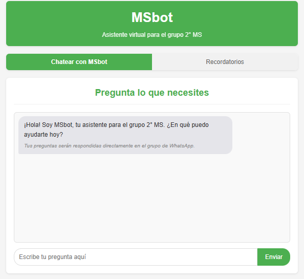

# MSBot - Asistente Virtual para 2° MS

<p align="center">
  
</p>

## Descripción
MSBot es un asistente virtual diseñado específicamente para el grupo de clase "2° MS". Este bot facilita la comunicación, dudas y organización de las actividades académicas a través de una interfaz web que se integra con WhatsApp.

## Características

### 🤖 Chat Asistente
- Interfaz web intuitiva para enviar consultas al bot
- Integración con WhatsApp para responder preguntas directamente en el grupo de clase
- Utiliza la API de Gemini para generar respuestas inteligentes a las consultas de los estudiantes

### 📅 Sistema de Recordatorios
- Permite a los estudiantes crear recordatorios para tareas y evaluaciones
- Organización por materias
- Visualización de próximos recordatorios
- Gestión (creación y eliminación) de recordatorios

## Tecnologías Utilizadas
- **Backend**: Flask (Python)
- **Frontend**: HTML, CSS, JavaScript
- **IA**: Gemini API para generación de respuestas
- **Mensajería**: Integración con WhatsApp


## Instalación y Configuración

### Requisitos Previos
- Python 3.7+
- Flask
- Navegador web compatible
- Cuenta de WhatsApp

### Pasos de Instalación
1. Clonar el repositorio
   ```
   git clone https://github.com/AgustinCoding/MSBot.git
   cd MSBot
   ```

2. Instalar dependencias
   ```
   pip install flask, requests, webdriver_manager, google-genai, google
   ```

3. Configurar API de Gemini
   - Obtener una clave API y configurarla en `gptmodel.py`
   - Tambien puedes usar la api actual ya que es gratuita

4. Iniciar la aplicación
   ```
   python backend/app.py
   ```

5. Abrir en el navegador: `http://127.0.0.1:5000/`

## Uso

### Chat con MSBot
1. Acceder a la página principal
2. Seleccionar la pestaña "Chatear con MSBot"
3. Escribir la consulta en el campo de texto
4. Presionar "Enviar"
5. La respuesta será enviada al grupo de WhatsApp "2° MS"

### Gestión de Recordatorios
1. Acceder a la pestaña "Recordatorios"
2. Para crear un recordatorio:
   - Seleccionar la materia
   - Ingresar descripción (ej: "Entrega de tarea de Matemáticas")
   - Establecer fecha y hora
   - Presionar "Agregar recordatorio"
3. Los recordatorios próximos se mostrarán en la sección inferior
4. Cada cierto tiempo se enviaran los recordatorios al grupo de Whatsapp

## Estado del Proyecto
- ✅ Funcionalidad de chat implementada
- ✅ Integración con WhatsApp
- ✅ Estructura para recordatorios
- 🔄 Implementación completa de recordatorios (en desarrollo)

## Próximas Mejoras
- Finalizar implementación de recordatorios
- Incorporar recursos compartidos para la clase

## Contribuciones
Las contribuciones son bienvenidas. Por favor, seguir estos pasos:
1. Fork del repositorio
2. Crear una rama para la funcionalidad (`git checkout -b feature/nueva-funcionalidad`)
3. Hacer commit de los cambios (`git commit -m 'Añadir nueva funcionalidad'`)
4. Push a la rama (`git push origin feature/nueva-funcionalidad`)
5. Abrir un Pull Request


## Contacto
+598 98 609 120
agustinrodriguezperez@hotmail.com
